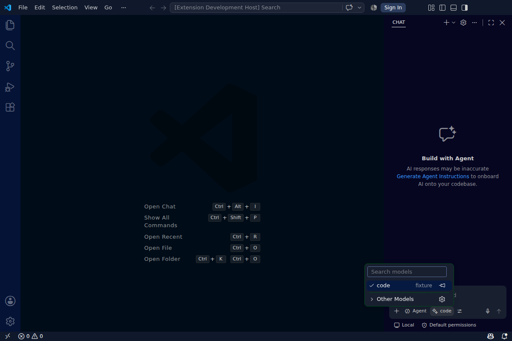
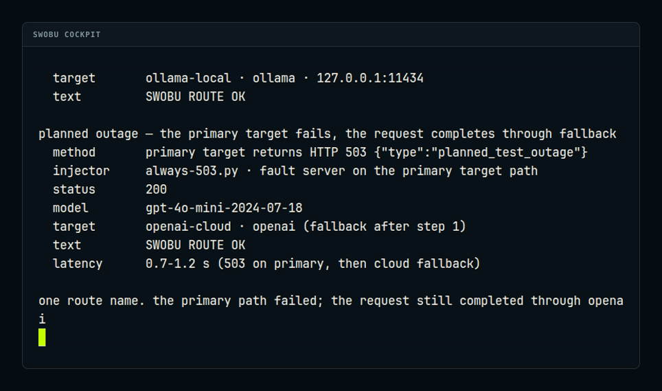

[English](README.md) | [简体中文](README.zh-CN.md) | [日本語](README.ja.md) | [Português](README.pt-BR.md) | [Bahasa Indonesia](README.id.md) | [한국어](README.ko.md) | [Español](README.es.md) | [Deutsch](README.de.md) | [Français](README.fr.md) | [Русский](README.ru.md) | [Українська](README.uk.md)

# [Swobu](https://swobu.com/) — roteador LLM e provedor de modelos para VS Code

Mantenha seu fluxo de programação. Escolha os modelos por trás dele.

Use uma rota Swobu como modelo nativo do VS Code ou conecte Claude Code e Codex mantendo as interfaces oficiais. Configure provedores e alternativas uma vez no Swobu; a rota permanece igual quando o modelo muda.

Instale a Preview pelo [Visual Studio Marketplace](https://marketplace.visualstudio.com/items?itemName=swobu.swobu) ou pesquise `swobu.swobu` no VS Code. Um único pacote independente de plataforma atende hosts de extensão locais, WSL, Remote SSH e contêineres de desenvolvimento.

## Modelos no VS Code

Abra **Manage Language Models**, escolha **Swobu** e selecione uma rota. Swobu gerencia a escolha de provedor e o fallback. Chamadas de ferramentas vêm ativadas para o VS Code Agent.

## Continue com Claude Code e Codex

Execute **Swobu: Connect Claude Code** ou **Swobu: Connect Codex**, escolha um espaço de trabalho e continue na interface oficial. O comando existente do Swobu cuida da configuração e da substituição segura.

## Por que rotas?

Um seletor de provedores troca o modelo no editor. Uma rota permite mudar a capacidade e configurar alternativas por trás de uma seleção estável. Mantenha o cliente e deixe a decisão de provedor com o Swobu.

## Primeiros passos

1. Abra **Swobu: Set Up** e configure seu acesso a modelos.
2. Crie uma rota para seu trabalho.
3. Selecione-a em **Manage Language Models** e peça ao Agent para ler um arquivo.
4. Abra **Swobu: Open** para examinar o tráfego roteado.

## Configurações do modelo

Em **Swobu: Configure Model**, escolha a rota. Imagens e ferramentas oferecem **Default**, **On**, **Off**. Contexto e saída oferecem valores predefinidos ou um inteiro positivo personalizado. **Reset overrides** restaura os padrões imediatamente, sem reiniciar.

Padrões: ferramentas ativadas, imagens desativadas, 32.768 tokens de entrada e 4.096 de saída. Você controla os recursos anunciados ao cliente; eles não são detectados automaticamente. Ative imagens apenas em uma rota com modelo compatível.

## Provedores e funcionamento

Configure capacidade no Swobu, incluindo OpenRouter, Ollama, Bedrock, Azure e endpoints compatíveis com OpenAI. As credenciais ficam no Swobu. O VS Code envia solicitações ao processo local do Swobu, que gerencia conexões, novas tentativas, fallback e uso. A extensão apresenta rotas como modelos e transmite as respostas.

## Privacidade e segurança

Solicitações, respostas e conteúdo de ferramentas passam temporariamente pela memória. A extensão não os armazena nem registra e não tem um emissor de telemetria separado. As configurações de privacidade do próprio Swobu se aplicam ao seu processo. Consulte [PRIVACY.md](PRIVACY.md) e [SECURITY.md](SECURITY.md).

## Remoto, WSL e contêineres

A extensão roda no host do espaço de trabalho. O endpoint loopback se refere a esse host: configure o Swobu no lado remoto quando necessário. Qualificação de pacotes e testes de instalação são requisitos do lançamento.

## Ajuda

Após alterar rotas, use **Swobu: Refresh Models**. Se o Swobu estiver indisponível, confira o endpoint definido para a máquina. Leia a saída da conexão antes de permitir substituições na configuração.

[Relate um problema](https://github.com/swobuforge/swobu-vscode/issues) com versão do VS Code, plataforma e mensagem de erro, sem credenciais ou solicitações privadas.

## Desenvolvimento e licença

Node 22 e VS Code 1.136 ou mais recente: `npm ci`, `npm test`, `npm run build`, `npm run package`. Com uma instalação comum e compatível do Swobu, execute também `npm run test:integration`; no Linux sem tela use `xvfb-run -a`.

Extensão: [MIT](LICENSE). O Swobu é instalado e licenciado separadamente; o VSIX não contém executável do Swobu. Swobu não tem afiliação com Microsoft, Anthropic ou OpenAI.
